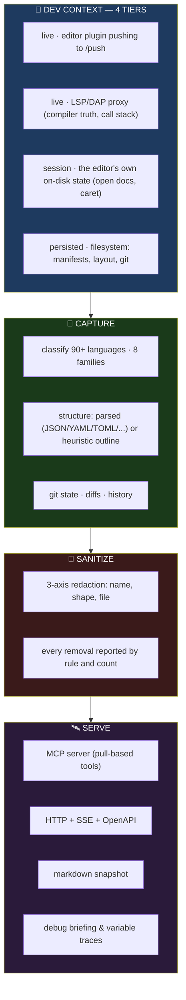
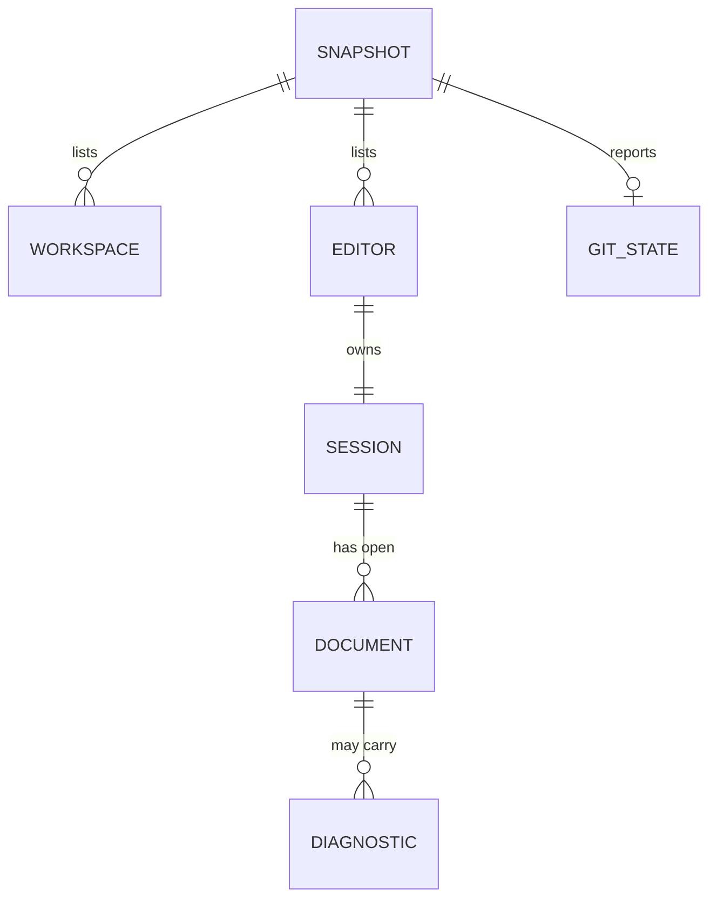
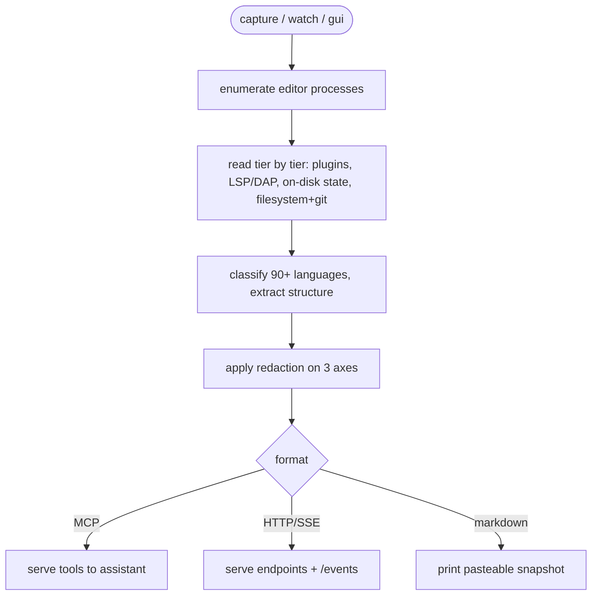
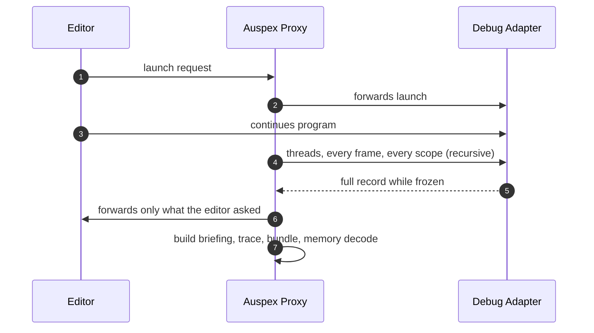

<div align="center">

**🌐 Choose Language / Selecione o Idioma / Elija el Idioma**

[](README.md)&nbsp;&nbsp;&nbsp;[](README_PT.md)&nbsp;&nbsp;&nbsp;[](README_ES.md)

</div>

---

<div align="center">

```
██╗   ██╗ █████╗ ██╗   ██╗██████╗ ███████╗██╗  ██╗
██║   ██║██╔══██╗██║   ██║██╔══██╗██╔════╝╚██╗██╔╝
██║   ██║███████║██║   ██║██████╔╝███████╗ ╚███╔╝
██║   ██║██╔══██║██║   ██║██╔═══╝ ╚════██║ ██╔██╗
╚██████╔╝██║  ██║╚██████╔╝██║     ███████║██╔╝ ██╗
 ╚═════╝ ╚═╝  ╚═╝ ╚═════╝ ╚═╝     ╚══════╝╚═╝  ╚═╝
 An editor-agnostic connector that serves any IDE's context to any AI
```

---

[](https://www.typescriptlang.org/)
[](https://nodejs.org/)
[]()
[]()
[]()
[]()
[]()
[]()

<br/>

> **Auspex reads what a developer is actually working on — editors, projects, active files, caret, diagnostics, git —**
> from **any editor** in **any language**, and serves it to **any AI** through MCP, plain HTTP, or markdown you can paste anywhere.
> Zero runtime dependencies, no compile step: Node 22.6+ strips the types at load time.

<br/>


</div>

---

## 📑 Table of Contents

<details>
<summary>▶️ <strong>Click to expand / collapse this section</strong></summary>

<table>
<tr>
<td valign="top" width="50%">

**🏗️ System**
- [Overview](#-overview)
- [System Architecture](#-system-architecture)
- [Technology Stack](#-technology-stack)
- [Design Patterns](#-design-patterns-applied)
- [Project Structure](#-project-structure)

**📦 Modules**
- [CLI Commands](#-cli--the-command-surface)
- [Context Capture](#-context-capture--what-is-going-on)
- [LSP / DAP Proxy](#-lsp--dap-proxy--deep-debug-capture)
- [MCP & HTTP Servers](#-mcp--http-server)
- [Redaction Layer](#-redaction-layer)

</td>
<td valign="top" width="50%">

**💼 Business**
- [Business Rules](#-business-rules)
- [Functional Requirements](#-functional-requirements)
- [Non-Functional Requirements](#-non-functional-requirements)

**📐 Design**
- [Data Model](#-data-model)
- [System Flows](#-system-flows)

**🔐 Security & Ops**
- [Security](#-security)
- [Installation & Execution](#-installation--execution)
- [Automated Tests](#-automated-tests)
- [Metrics & Monitoring](#-metrics--monitoring)
- [Known Limitations](#-known-limitations)

</td>
</tr>
</table>

---

</details>

## 🌟 Overview

<details>
<summary>▶️ <strong>Click to expand / collapse this section</strong></summary>

**Auspex** is an editor-agnostic connector and debugging tool. It reads what a developer is actually working on — which editors and projects are open, which files are being edited and where the caret is, what the compiler is complaining about, what git says — from **any IDE or editor**, in **any language**, and serves it to **any AI** through MCP, plain HTTP, or text you can paste anywhere.

It works in the terminal and in a browser, and it has **no runtime dependencies at all**: Node 22.6+ strips the type annotations at load, so there is no build step. Clone it and run it.

### 🎯 System Objectives

| Objective | Description |
|-----------|-------------|
| 🔍 **Universal context capture** | Read open folders, tabs, active file, caret, diagnostics and git state from any editor |
| 🧩 **Language indifference** | Classify files across 90+ languages in 8 families, parsed or heuristic |
| 🛰️ **AI plug-ability** | Expose the same context over MCP, HTTP+SSE+OpenAPI, or markdown |
| 🔬 **Deep debug capture** | Record a paused program — threads, frames, variables, values, memory — via an LSP/DAP proxy |
| 🔒 **Safe by default** | Redaction on by default, secrets reported, no keys held, no AI API ever called |

---

</details>

## 🏗️ System Architecture

<details>
<summary>▶️ <strong>Click to expand / collapse this section</strong></summary>

### Flow Diagram



### Architecture Layers

| Layer | Role |
|-------|------|
| 🪟 **Platform adapters** | VS Code family, JetBrains family, Visual Studio, Sublime, Zed, Neovim, Vim, Emacs, Helix, Nova, Xcode, Eclipse, NetBeans, Notepad++, Kate, Geany + catch-all |
| 🧠 **Language layer** | Exact filename → shebang → extension; parsed grammars vs. declaration-shape heuristics with honest labels |
| 🔬 **Debug proxy** | Intercepts the DAP/LSP session, issues its own requests while the program is frozen, never writes to the debuggee |
| 🛰️ **Server layer** | MCP tools, HTTP endpoints (`/context`, `/documents`, `/diagnostics`, `/file`, `/git`, `/debug`, `/events`, `/push`) |
| 🔐 **Redaction layer** | Name-based, shape-based and file-based removal, everything reported |

---

</details>

## 🛠️ Technology Stack

<details>
<summary>▶️ <strong>Click to expand / collapse this section</strong></summary>

<table>
<thead>
<tr>
<th>Layer</th>
<th>Technology</th>
<th>Version</th>
<th>Purpose</th>
</tr>
</thead>
<tbody>
<tr>
<td><strong>🧠 Language</strong></td>
<td>TypeScript (ESM)</td>
<td>5.7 (dev only)</td>
<td>44 modules; stripped at load, never compiled</td>
</tr>
<tr>
<td><strong>⚙️ Runtime</strong></td>
<td>Node.js</td>
<td>≥ 22.6</td>
<td>Native type stripping — zero build step</td>
</tr>
<tr>
<td><strong>🛰️ Protocol</strong></td>
<td>MCP · HTTP/SSE · OpenAPI · markdown</td>
<td>—</td>
<td>Three doors for any assistant to plug in</td>
</tr>
<tr>
<td><strong>🔬 Debugging</strong></td>
<td>LSP / DAP proxy</td>
<td>—</td>
<td>Compiler diagnostics, symbol trees, paused call stacks</td>
</tr>
<tr>
<td><strong>🔄 Data sources</strong></td>
<td>Editor plugins, on-disk state, filesystem, git</td>
<td>—</td>
<td>Four capture tiers with per-datum provenance and trust</td>
</tr>
<tr>
<td><strong>🧪 Testing</strong></td>
<td>node:test (built-in)</td>
<td>—</td>
<td>121 tests across 10 files, no framework dependency</td>
</tr>
<tr>
<td><strong>🔧 Tooling</strong></td>
<td>tsc --noEmit, MIT</td>
<td>—</td>
<td>Type-check only; license</td>
</tr>
</tbody>
</table>

---

</details>

## 📐 Design Patterns Applied

<details>
<summary>▶️ <strong>Click to expand / collapse this section</strong></summary>

| Pattern | Where | Rationale |
|---------|-------|-----------|
| 🔂 **Adapter / Strategy** | One adapter per editor, tiered by capability | Each editor exposes different data with different freshness |
| 🪜 **Tiered fallback** | live → session → persisted | The bottom tier (filesystem) is the floor that makes "any editor" true |
| 🏷️ **Honest labeling** | `parsed` vs `heuristic` on every datum | A model needs to know how much to trust a result |
| 🔬 **Proxy / Decorator** | LSP/DAP proxy between editor and adapter | Capture full fidelity without touching the debuggee |
| 🎯 **Priority ordering** | Deterministic context budget (`--max-tokens`) | Dropping is by documented priority, never arbitrary |
| 👁️ **Observer** | `/push`, WS watch, watch mode | Live change notifications for editors that can push |
| 🚦 **Guard rails** | Redaction report, `--no-redact` warning | Safety is opt-out and visibly so |

---

</details>

## 📁 Project Structure

<details>
<summary>▶️ <strong>Click to expand / collapse this section</strong></summary>

```
auspex/
│
├── 📄 package.json                  # ESM, bin auspex → src/cli/main.ts, no deps
├── 📄 tsconfig.json                 # type-check only
│
├── 📂 src/
│   ├── 📂 core/                     # normalized context model, redaction, budgets
│   ├── 📂 adapters/                 # per-editor + filesystem + git adapters
│   ├── 📂 languages/                # 90+ language classification, 2-tier structure
│   ├── 📂 platform/                 # OS process discovery (editors, workspaces)
│   ├── 📂 debug/                    # DAP proxy, deep capture, briefing, tracing
│   ├── 📂 server/                   # MCP + HTTP/SSE + OpenAPI + push endpoints
│   ├── 📂 ai/                       # assistant-facing tool/format shaping
│   └── 📂 cli/                      # main.ts — capture/watch/gui/mcp/serve/debug/connect
│
├── 📂 extensions/vscode/            # zero-config plugin (debug adapter tracker)
├── 📂 docs/                         # ARCHITECTURE, ADAPTERS, DEBUG, AI-DEBUGGING, ROADMAP
├── 📂 tests/                        # 10 *.test.ts files + fixtures
│
├── 📄 README.md                     # 🇺🇸 English (primary)
├── 📄 README_PT.md                  # 🇧🇷 Português
└── 📄 README_ES.md                  # 🇪🇸 Español
```

---

</details>

## 📦 System Modules

<details>
<summary>▶️ <strong>Click to expand / collapse this section</strong></summary>

### 🖥️ CLI — the command surface

| Command | What it does |
|---------|--------------|
| `capture` | What is happening right now, in the terminal |
| `watch` | The same, live |
| `gui` | The same, in a browser |
| `mcp` | The same, as an MCP server for Claude |
| `serve` | The same, as HTTP + SSE + OpenAPI for GPT/Gemini |
| `doctor` | Why is my capture thin? |
| `connect mcp / openai / gemini` | Print the config to paste into each assistant |

### 📡 Context Capture — what is going on

Reads editors, workspaces, active file, caret, unsaved buffers, diagnostics and git state. Every datum is tagged with **which tier it came from and how much to trust it**.

### 🔬 LSP / DAP Proxy — deep debug capture

Put Auspex between the editor and its debug adapter and it captures the whole of a paused process: every thread, frame, scope, variable expanded recursively, raw memory, loaded modules, and what changed since the last stop. Commands: `proxy --dap --deep -- <adapter>`, `debug`, `debug trace`, `debug threads`, `debug bundle`. The VS Code extension registers a debug adapter tracker for **every** adapter — F5 captures the session with zero configuration.

### 🛰️ MCP & HTTP Server

MCP tools: `get_context`, `get_open_files`, `get_diagnostics`, `get_file`, `search`, `get_git_status`, `list_editors` plus a full debug tool suite. HTTP: `/context`, `/documents`, `/diagnostics`, `/file`, `/git`, `/debug` + `/events` (SSE) and `/push` (plugins). Markdown `capture --format markdown` is the universal fallback.

### 🔐 Redaction Layer

Name of a key, shape of a value, and the file it lives in — three axes at once. Credential-only files (`.env`, `id_rsa`, `*.pem`, `.npmrc`, `credentials`) are refused by name; `.env` variable *names* are kept, values never. Every removal is reported by rule and count.

---

</details>

## 📋 Business Rules

<details>
<summary>▶️ <strong>Click to expand / collapse this section</strong></summary>

| # | Rule | Enforcement |
|---|------|-------------|
| BR-01 | Redaction is on by default; disabling requires `--no-redact` and a warning | CLI flag + printed warning |
| BR-02 | Credential-only files are refused by name, never read and scrubbed | File-based redaction list |
| BR-03 | Every removed secret is reported by rule and count | Redaction report in every snapshot |
| BR-04 | Every datum says which tier produced it and how much to trust it | Provenance metadata |
| BR-05 | The debug proxy never writes to the debuggee | No `setVariable`, no injected `evaluate` |
| BR-06 | Auspex never calls an AI API and holds no keys | Serve-only architecture; it does the reading, you do the asking |
| BR-07 | Context budgets drop by a documented deterministic priority order | `--max-tokens` + `warnings` list |

---

</details>

## ✨ Functional Requirements

<details>
<summary>▶️ <strong>Click to expand / collapse this section</strong></summary>

| ID | Requirement | Priority | Status |
|----|-------------|----------|--------|
| **RF-01** | Capture editors, workspaces, active file, caret and diagnostics | 🔴 High | ✅ Implemented |
| **RF-02** | Support dedicated adapters for 30+ editors + a catch-all | 🔴 High | ✅ Implemented |
| **RF-03** | Classify files across 90+ languages in 8 families | 🔴 High | ✅ Implemented |
| **RF-04** | Provide genuinely parsed structure for JSON/YAML/TOML/INI/CSV/etc. | 🟡 Medium | ✅ Implemented |
| **RF-05** | Label heuristic outlines honestly | 🟡 Medium | ✅ Implemented |
| **RF-06** | Read git status, diffs and history | 🟡 Medium | ✅ Implemented |
| **RF-07** | Serve context over MCP, HTTP+SSE+OpenAPI and markdown | 🔴 High | ✅ Implemented |
| **RF-08** | Capture a full LSP/DAP debug session without touching the debuggee | 🔴 High | ✅ Implemented |
| **RF-09** | Produce AI-shaped debug briefings and variable traces | 🟡 Medium | ✅ Implemented |
| **RF-10** | Redact secrets on three axes, reporting every removal | 🔴 High | ✅ Implemented |
| **RF-11** | Fit captures to a token budget by deterministic priority | 🟡 Medium | ✅ Implemented |
| **RF-12** | Run `watch` live and `gui` in the browser | 🟢 Low | ✅ Implemented |

---

</details>

## ⚙️ Non-Functional Requirements

<details>
<summary>▶️ <strong>Click to expand / collapse this section</strong></summary>

| ID | Category | Requirement | Target |
|----|----------|-------------|--------|
| **RNF-01** | 🧱 Dependencies | Runtime dependencies | Zero — stdlib + Node only |
| **RNF-02** | ⚡ Build | Compile step | None — Node 22.6+ type stripping |
| **RNF-03** | 📱 Compatibility | Node floor | ≥ 22.6 |
| **RNF-04** | ⚡ Performance | Full capture of a working machine | Sized by `--max-tokens`, sub-megabyte typical |
| **RNF-05** | 🔐 Privacy | Secrets handled | Redact by default, report every removal |
| **RNF-06** | 🔐 Privacy | AI API calls | Never — no keys, no outbound AI traffic |
| **RNF-07** | 🧱 Maintainability | Test coverage | 121 tests over 10 files, including debug end-to-end |

---

</details>

## 🗄️ Data Model

<details>
<summary>▶️ <strong>Click to expand / collapse this section</strong></summary>

> [!NOTE]
> Auspex keeps no database. Its "data model" is the normalized context snapshot and the portable debug-session bundle.

### Context Snapshot



| Entity | Contents |
|--------|----------|
| `workspace` | root, file counts/size, language breakdown, manifests, git status |
| `editor` / `session` | pid, adapters, open documents, caret, selection, unsaved buffers |
| `document` | path, language family, diagnostics with severity |
| `git_state` | branch, changed files, diffs, commit history (by budget) |

### Debug Session Bundle

`debug bundle f.gz` writes a portable, context-budgeted record of the whole paused session — threads, frames, every variable with its values, raw memory, plus the source itself — for attaching to a bug report.

---

</details>

## 🔄 System Flows

<details>
<summary>▶️ <strong>Click to expand / collapse this section</strong></summary>

### Capture Flow



### Debug Session Flow



---

</details>

## 🔐 Security

<details>
<summary>▶️ <strong>Click to expand / collapse this section</strong></summary>

### Implemented Controls

| Control | Implementation | Effect |
|---------|---------------|--------|
| 🔐 **Default redaction** | 3-axis rule set (name, shape, file) | Secrets stripped unless explicitly disabled |
| 🚫 **Filename refusal** | `.env`, `id_rsa`, `*.pem`, `.npmrc`, `credentials` never read | No scrubbing of files that exist only to hold credentials |
| 📋 **Redaction report** | Every removal by rule and count | Nothing silently blanked |
| 🔬 **Read-only debug** | No `setVariable`, no injected `evaluate` | Auspex can't change what it measures |
| 🚫 **No AI egress** | Never calls an AI API, holds no keys | Your context goes only where you send it |
| 📦 **Standalone HTML** | (csradar pattern, none here) | — |

### Known Security Limitations

| Limitation | Risk | Mitigation path |
|------------|------|-----------------|
| 🪶 **Innocuous secrets pass** | A secret that looks like ordinary text under an ordinary name will pass through | No redactor can fix this; documented honestly |
| 🧪 **Distrust of third parties** | Your working context is handed to whatever assistant you connect | MCP is pull-based: the assistant only receives what it asks for |
| 📄 **No network in tests** | Node's built-in test runner | Tests are hermetic and runtime-dependency-free |

---

</details>

## 🚀 Installation & Execution

<details>
<summary>▶️ <strong>Click to expand / collapse this section</strong></summary>

### Prerequisites

```bash
node --version   # Node 22.6 or newer (type stripping)
```

### Install & Run

```bash
git clone <this repo> && cd auspex
npm test                 # 121 tests, no install needed
node src/cli/main.ts editors   # what can I see?
```

`npm install` is only needed for `npm run typecheck` (TypeScript as a dev dependency); nothing is required to run.

### Commands

```bash
node src/cli/main.ts capture            # snapshot now
node src/cli/main.ts watch              # live
node src/cli/main.ts gui                # in the browser
node src/cli/main.ts mcp                # MCP server for Claude
node src/cli/main.ts serve              # HTTP + SSE + OpenAPI
node src/cli/main.ts proxy --dap --deep -- <adapter>  # deep debug
node src/cli/main.ts debug ...          # briefing / trace / threads / bundle
node src/cli/main.ts connect mcp        # paste this config into Claude
```

### VS Code Extension

Copy `extensions/vscode` into the extensions directory, run `serve`, and the caret, selections and unsaved buffers start arriving. It needs no configuration at all.

---

</details>

## 🧪 Automated Tests

<details>
<summary>▶️ <strong>Click to expand / collapse this section</strong></summary>

### Test Architecture

```bash
npm test                # node --test "tests/*.test.ts"
npm run typecheck       # tsc --noEmit
```

121 tests across 10 files covering: adapters, languages, core model, server endpoints, and **debug end-to-end** — proxy capture, value interpretation, querying, analysis and AI briefing shape. Test fixtures live in `tests/fixtures`.

### Coverage Highlights

| Suite | Scope |
|-------|-------|
| `adapters.test.ts` | Every editor adapter tier exercised |
| `languages.test.ts` | 90+ language classification, parsed vs heuristic |
| `core.test.ts` | Redaction, model, budgets |
| `server.test.ts` | MCP + HTTP endpoints |
| `debug-*.test.ts` (5 files) | Proxy capture, values, analysis, querying, AI briefing |

---

</details>

## 📊 Metrics & Monitoring

<details>
<summary>▶️ <strong>Click to expand / collapse this section</strong></summary>

| Metric | Value |
|--------|-------|
| TypeScript modules | 44 |
| Test files / tests | 10 / 121 passing |
| Languages recognized | 90+, in 8 families |
| Editor adapters | 30+ dedicated + catch-all |
| Runtime dependencies | 0 |
| Node floor | 22.6 |

### Diagnostic Commands

```bash
node src/cli/main.ts doctor       # why is my capture thin?
node src/cli/main.ts serve        # then curl localhost:<port>/context
```

---

</details>

## ⚠️ Known Limitations

<details>
<summary>▶️ <strong>Click to expand / collapse this section</strong></summary>

> [!IMPORTANT]
> Auspex is a reader and a serving layer, deliberately not a diagnoser — knowing `user` is `None` does not say whether the fault is the dereference, the lookup, or the caller.

| Category | Issue | Status |
|----------|-------|--------|
| 🪶 **Innocuous secrets** | A secret shaped like ordinary text passes through | ⚠️ Documented; inherent to redaction |
| 🧩 **Unknown languages** | Only heuristic outlines for languages never met | ⚠️ Mitigated by the LSP proxy for exact symbols |
| ⚡ **Node floor** | Requires Node ≥ 22.6 for type stripping | ⚠️ Documented trade-off for zero build |
| 🧩 **Stale pasted snapshots** | A markdown paste is stale by the first reply | ⚠️ MCP is pull-based and preferred for this reason |
| 🔬 **POV vs server demos** | n/a here | — |

</details>

---

<div align="center">

---

### 🔭 Auspex

*Reads any editor. Serves any AI.*

[](https://www.typescriptlang.org/)
[](https://nodejs.org/)
[]()

<br/>

```
"One tool to read any IDE, for any AI — with nothing to install."
```

</div>