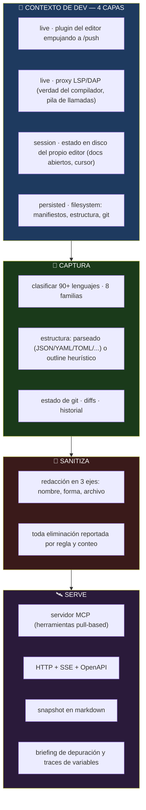
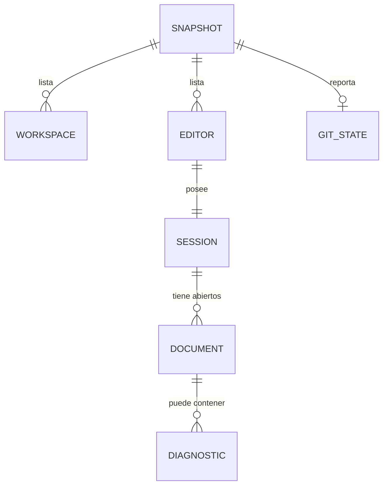
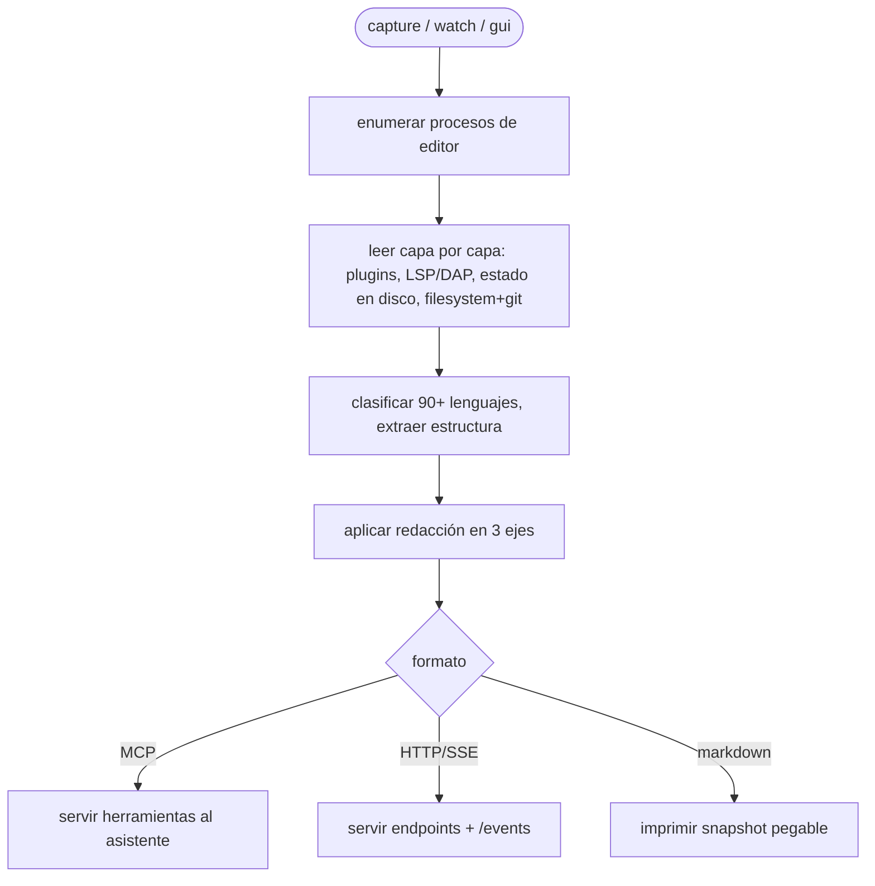
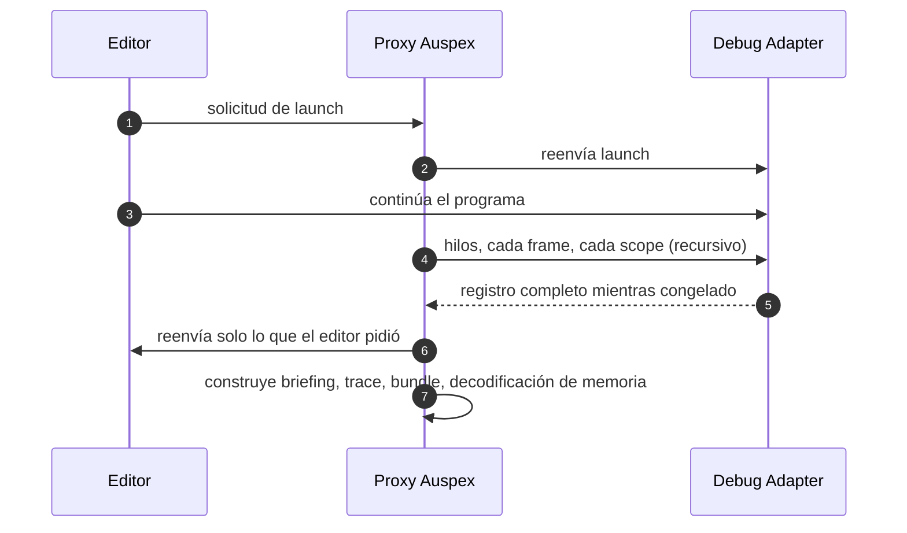

<div align="center">

**🌐 Choose Language / Selecione o Idioma / Elija el Idioma**

[](README.md)&nbsp;&nbsp;&nbsp;[](README_PT.md)&nbsp;&nbsp;&nbsp;[](README_ES.md)

</div>

---

<div align="center">

```
██╗   ██╗ █████╗ ██╗   ██╗██████╗ ███████╗██╗  ██╗
██║   ██║██╔══██╗██║   ██║██╔══██╗██╔════╝╚██╗██╔╝
██║   ██║███████║██║   ██║██████╔╝███████╗ ╚███╔╝
██║   ██║██╔══██║██║   ██║██╔═══╝ ╚════██║ ██╔██╗
╚██████╔╝██║  ██║╚██████╔╝██║     ███████║██╔╝ ██╗
 ╚═════╝ ╚═╝  ╚═╝ ╚═════╝ ╚═╝     ╚══════╝╚═╝  ╚═╝
 Un conector agnóstico de editor que lleva el contexto de cualquier IDE a cualquier IA
```

---

[](https://www.typescriptlang.org/)
[](https://nodejs.org/)
[]()
[]()
[]()
[]()
[]()
[]()

<br/>

> **Auspex lee lo que el desarrollador está haciendo de verdad — editores, proyectos, archivo activo, cursor, diagnósticos, git —**
> desde **cualquier editor**, en **cualquier lenguaje**, y lo entrega a **cualquier IA** vía MCP, HTTP puro o markdown que pegas donde sea.
> Cero dependencias de runtime, sin paso de compilación: Node 22.6+ elimina los tipos al cargar.

<br/>


</div>

---

## 📑 Tabla de Contenidos

<details>
<summary>▶️ <strong>Haga clic para expandir / contraer esta sección</strong></summary>

<table>
<tr>
<td valign="top" width="50%">

**🏗️ Sistema**
- [Visión General](#-visión-general)
- [Arquitectura del Sistema](#-arquitectura-del-sistema)
- [Stack Tecnológico](#-stack-tecnológico)
- [Patrones de Diseño](#-patrones-de-diseño-aplicados)
- [Estructura del Proyecto](#-estructura-del-proyecto)

**📦 Módulos**
- [Comandos CLI](#-cli--la-superficie-de-comandos)
- [Captura de Contexto](#-captura-de-contexto--qué-está-pasando)
- [Proxy LSP / DAP](#-proxy-lsp--dap--captura-profunda-de-depurado)
- [Servidor MCP & HTTP](#-servidor-mcp--http)
- [Capa de Redacción](#-capa-de-redacción)

</td>
<td valign="top" width="50%">

**💼 Negocio**
- [Reglas de Negocio](#-reglas-de-negocio)
- [Requisitos Funcionales](#-requisitos-funcionales)
- [Requisitos No Funcionales](#-requisitos-no-funcionales)

**📐 Diseño**
- [Modelo de Datos](#-modelo-de-datos)
- [Flujos del Sistema](#-flujos-del-sistema)

**🔐 Seguridad & Operación**
- [Seguridad](#-seguridad)
- [Instalación & Ejecución](#-instalación--ejecución)
- [Pruebas Automatizadas](#-pruebas-automatizadas)
- [Métricas & Monitoreo](#-métricas--monitoreo)
- [Limitaciones Conocidas](#-limitaciones-conocidas)

</td>
</tr>
</table>

---

</details>

## 🌟 Visión General

<details>
<summary>▶️ <strong>Haga clic para expandir / contraer esta sección</strong></summary>

**Auspex** es un conector agnóstico de editor y una herramienta de depuración. Lee lo que el desarrollador está haciendo de verdad — qué editores y proyectos están abiertos, qué archivos se están editando y dónde está el cursor, de qué se queja el compilador, qué dice git — desde **cualquier IDE o editor**, en **cualquier lenguaje**, y lo sirve a **cualquier IA** vía MCP, HTTP puro o texto que pegas donde sea.

Funciona en la terminal y en el navegador, y no tiene **ninguna dependencia de runtime**: Node 22.6+ elimina las anotaciones de tipo al cargar, así que no hay paso de compilación. Clónalo y ejecútalo.

### 🎯 Objetivos del Sistema

| Objetivo | Descripción |
|----------|-------------|
| 🔍 **Captura universal de contexto** | Leer carpetas abiertas, pestañas, archivo activo, cursor, diagnósticos y estado de git desde cualquier editor |
| 🧩 **Indiferencia al lenguaje** | Clasificar archivos en 90+ lenguajes en 8 familias, parseados o heurísticos |
| 🛰️ **Conectable a IA** | Exponer el mismo contexto vía MCP, HTTP+SSE+OpenAPI o markdown |
| 🔬 **Captura profunda de depurado** | Grabar un programa pausado — hilos, frames, variables, valores, memoria — vía proxy LSP/DAP |
| 🔒 **Seguro por defecto** | Redacción activada por defecto, secretos reportados, sin llaves, sin llamar a una API de IA |

---

</details>

## 🏗️ Arquitectura del Sistema

<details>
<summary>▶️ <strong>Haga clic para expandir / contraer esta sección</strong></summary>

### Diagrama de Flujo



### Capas de la Arquitectura

| Capa | Rol |
|------|-----|
| 🪟 **Adaptadores de plataforma** | Familia VS Code, familia JetBrains, Visual Studio, Sublime, Zed, Neovim, Vim, Emacs, Helix, Nova, Xcode, Eclipse, NetBeans, Notepad++, Kate, Geany + catch-all |
| 🧠 **Capa de lenguaje** | Nombre exacto del archivo → shebang → extensión; gramáticas parseadas vs. heurísticas de forma de declaración con etiquetas honestas |
| 🔬 **Proxy de depuración** | Intercepta la sesión DAP/LSP, emite sus propias peticiones mientras el programa está congelado, nunca escribe en el debuggee |
| 🛰️ **Capa de servidor** | Herramientas MCP, endpoints HTTP (`/context`, `/documents`, `/diagnostics`, `/file`, `/git`, `/debug`, `/events`, `/push`) |
| 🔐 **Capa de redacción** | Eliminación por nombre, por forma y por archivo, todo reportado |

---

</details>

## 🛠️ Stack Tecnológico

<details>
<summary>▶️ <strong>Haga clic para expandir / contraer esta sección</strong></summary>

<table>
<thead>
<tr>
<th>Capa</th>
<th>Tecnología</th>
<th>Versión</th>
<th>Propósito</th>
</tr>
</thead>
<tbody>
<tr>
<td><strong>🧠 Lenguaje</strong></td>
<td>TypeScript (ESM)</td>
<td>5.7 (solo dev)</td>
<td>44 módulos; tipos eliminados al cargar, nunca compilado</td>
</tr>
<tr>
<td><strong>⚙️ Runtime</strong></td>
<td>Node.js</td>
<td>≥ 22.6</td>
<td>Eliminación nativa de tipos — cero paso de build</td>
</tr>
<tr>
<td><strong>🛰️ Protocolo</strong></td>
<td>MCP · HTTP/SSE · OpenAPI · markdown</td>
<td>—</td>
<td>Tres puertas para que cualquier asistente se conecte</td>
</tr>
<tr>
<td><strong>🔬 Depuración</strong></td>
<td>Proxy LSP / DAP</td>
<td>—</td>
<td>Diagnósticos del compilador, árboles de símbolos, pilas pausadas</td>
</tr>
<tr>
<td><strong>🔄 Fuentes de datos</strong></td>
<td>Plugins de editor, estado en disco, filesystem, git</td>
<td>—</td>
<td>Cuatro capas de captura con procedencia y confianza por dato</td>
</tr>
<tr>
<td><strong>🧪 Pruebas</strong></td>
<td>node:test (nativo)</td>
<td>—</td>
<td>121 pruebas en 10 archivos, sin dependencia de framework</td>
</tr>
<tr>
<td><strong>🔧 Herramientas</strong></td>
<td>tsc --noEmit, MIT</td>
<td>—</td>
<td>Solo type-check; licencia</td>
</tr>
</tbody>
</table>

---

</details>

## 📐 Patrones de Diseño Aplicados

<details>
<summary>▶️ <strong>Haga clic para expandir / contraer esta sección</strong></summary>

| Patrón | Dónde | Justificación |
|--------|-------|---------------|
| 🔂 **Adapter / Strategy** | Un adaptador por editor, en capas por capacidad | Cada editor expone datos distintos con frescura distinta |
| 🪜 **Fallback en capas** | live → session → persisted | La capa inferior (filesystem) es el piso que hace verdad "cualquier editor" |
| 🏷️ **Etiqueta honesta** | `parsed` vs `heuristic` en cada dato | Un modelo necesita saber cuánto confiar en un resultado |
| 🔬 **Proxy / Decorator** | Proxy LSP/DAP entre el editor y el adaptador | Capturar fidelidad total sin tocar el debuggee |
| 🎯 **Orden por prioridad** | Presupuesto de contexto determinístico (`--max-tokens`) | Descartar sigue una prioridad documentada, nunca arbitraria |
| 👁️ **Observer** | `/push`, watch vía WS, modo watch | Notificaciones de cambio en vivo para editores que pueden empujar |
| 🚦 **Guardas** | Informe de redacción, aviso del `--no-redact` | La seguridad es opt-out y visible como tal |

---

</details>

## 📁 Estructura del Proyecto

<details>
<summary>▶️ <strong>Haga clic para expandir / contraer esta sección</strong></summary>

```
auspex/
│
├── 📄 package.json                  # ESM, bin auspex → src/cli/main.ts, sin deps
├── 📄 tsconfig.json                 # solo type-check
│
├── 📂 src/
│   ├── 📂 core/                     # modelo de contexto normalizado, redacción, presupuestos
│   ├── 📂 adapters/                 # adaptadores por editor + filesystem + git
│   ├── 📂 languages/                # clasificación de 90+ lenguajes, estructura en 2 capas
│   ├── 📂 platform/                 # descubrimiento de procesos del SO (editores, workspaces)
│   ├── 📂 debug/                    # proxy DAP, captura profunda, briefing, tracing
│   ├── 📂 server/                   # endpoints MCP + HTTP/SSE + OpenAPI + push
│   ├── 📂 ai/                       # modelado de herramientas/formato para el asistente
│   └── 📂 cli/                      # main.ts — capture/watch/gui/mcp/serve/debug/connect
│
├── 📂 extensions/vscode/            # plugin zero-config (tracker de debug adapter)
├── 📂 docs/                         # ARCHITECTURE, ADAPTERS, DEBUG, AI-DEBUGGING, ROADMAP
├── 📂 tests/                        # 10 archivos *.test.ts + fixtures
│
├── 📄 README.md                     # 🇺🇸 Inglés (principal)
├── 📄 README_PT.md                  # 🇧🇷 Portugués
└── 📄 README_ES.md                  # 🇪🇸 Español
```

---

</details>

## 📦 Módulos del Sistema

<details>
<summary>▶️ <strong>Haga clic para expandir / contraer esta sección</strong></summary>

### 🖥️ CLI — la superficie de comandos

| Comando | Qué hace |
|---------|----------|
| `capture` | Qué está pasando ahora, en la terminal |
| `watch` | Lo mismo, en vivo |
| `gui` | Lo mismo, en el navegador |
| `mcp` | Lo mismo, como servidor MCP para Claude |
| `serve` | Lo mismo, como HTTP + SSE + OpenAPI para GPT/Gemini |
| `doctor` | ¿Por qué mi captura es pobre? |
| `connect mcp / openai / gemini` | Imprime la config para pegar en cada asistente |

### 📡 Captura de Contexto — qué está pasando

Lee editores, workspaces, archivo activo, cursor, buffers sin guardar, diagnósticos y estado de git. Cada dato está etiquetado con **de qué capa vino y cuánto confiar en él**.

### 🔬 Proxy LSP / DAP — captura profunda de depuración

Coloca Auspex entre el editor y su debug adapter y captura todo el proceso pausado: cada hilo, frame, scope, variable expandida recursivamente, memoria en bruto, módulos cargados y qué cambió desde la última parada. Comandos: `proxy --dap --deep -- <adapter>`, `debug`, `debug trace`, `debug threads`, `debug bundle`. La extensión de VS Code registra un tracker de debug adapter para **cada** adapter — F5 captura la sesión con cero configuración.

### 🛰️ Servidor MCP & HTTP

Herramientas MCP: `get_context`, `get_open_files`, `get_diagnostics`, `get_file`, `search`, `get_git_status`, `list_editors` más un set completo de herramientas de depuración. HTTP: `/context`, `/documents`, `/diagnostics`, `/file`, `/git`, `/debug` + `/events` (SSE) y `/push` (plugins). Markdown `capture --format markdown` es el fallback universal.

### 🔐 Capa de Redacción

Nombre de la llave, forma del valor y el archivo donde vive — tres ejes a la vez. Los archivos que solo contienen credenciales (`.env`, `id_rsa`, `*.pem`, `.npmrc`, `credentials`) se rechazan por nombre; los *nombres* de variables del `.env` se conservan, los valores nunca. Toda eliminación se reporta por regla y conteo.

---

</details>

## 📋 Reglas de Negocio

<details>
<summary>▶️ <strong>Haga clic para expandir / contraer esta sección</strong></summary>

| # | Regla | Aplicación |
|---|-------|------------|
| BR-01 | Redacción activada por defecto; desactivar exige `--no-redact` y un aviso | Flag de CLI + aviso impreso |
| BR-02 | Los archivos que solo contienen credenciales se rechazan por nombre, nunca se leen y limpian | Lista de redacción por archivo |
| BR-03 | Todo secreto eliminado se reporta por regla y conteo | Informe de redacción en cada snapshot |
| BR-04 | Todo dato dice qué capa lo produjo y cuánto confiar en él | Metadatos de procedencia |
| BR-05 | El proxy de depuración nunca escribe en el debuggee | Sin `setVariable`, sin `evaluate` inyectado |
| BR-06 | Auspex nunca llama a una API de IA y no guarda llaves | Arquitectura solo-servidor: él lee, tú preguntas |
| BR-07 | Los presupuestos de contexto descartan por orden de prioridad determinístico documentado | `--max-tokens` + lista `warnings` |

---

</details>

## ✨ Requisitos Funcionales

<details>
<summary>▶️ <strong>Haga clic para expandir / contraer esta sección</strong></summary>

| ID | Requisito | Prioridad | Estado |
|----|-----------|-----------|--------|
| **RF-01** | Capturar editores, workspaces, archivo activo, cursor y diagnósticos | 🔴 Alta | ✅ Implementado |
| **RF-02** | Soportar adaptadores dedicados para 30+ editores + catch-all | 🔴 Alta | ✅ Implementado |
| **RF-03** | Clasificar archivos en 90+ lenguajes en 8 familias | 🔴 Alta | ✅ Implementado |
| **RF-04** | Estructura genuinamente parseada para JSON/YAML/TOML/INI/CSV/etc. | 🟡 Media | ✅ Implementado |
| **RF-05** | Etiquetar outlines heurísticos con honestidad | 🟡 Media | ✅ Implementado |
| **RF-06** | Leer estado, diffs e historial de git | 🟡 Media | ✅ Implementado |
| **RF-07** | Servir contexto vía MCP, HTTP+SSE+OpenAPI y markdown | 🔴 Alta | ✅ Implementado |
| **RF-08** | Capturar la sesión de depuración LSP/DAP completa sin tocar el debuggee | 🔴 Alta | ✅ Implementado |
| **RF-09** | Producir briefings de depuración y traces de variables en el formato de la IA | 🟡 Media | ✅ Implementado |
| **RF-10** | Redactar secretos en tres ejes, reportando toda eliminación | 🔴 Alta | ✅ Implementado |
| **RF-11** | Ajustar capturas a un presupuesto de tokens por prioridad determinística | 🟡 Media | ✅ Implementado |
| **RF-12** | Ejecutar `watch` en vivo y `gui` en el navegador | 🟢 Baja | ✅ Implementado |

---

</details>

## ⚙️ Requisitos No Funcionales

<details>
<summary>▶️ <strong>Haga clic para expandir / contraer esta sección</strong></summary>

| ID | Categoría | Requisito | Meta |
|----|-----------|-----------|------|
| **RNF-01** | 🧱 Dependencias | Dependencias de runtime | Cero — solo stdlib y Node |
| **RNF-02** | ⚡ Build | Paso de compilación | Ninguno — eliminación de tipos de Node 22.6+ |
| **RNF-03** | 📱 Compatibilidad | Piso de Node | ≥ 22.6 |
| **RNF-04** | ⚡ Performance | Captura completa de una máquina en uso | Dimensionada por `--max-tokens`, normalmente < 1 MB |
| **RNF-05** | 🔐 Privacidad | Tratamiento de secretos | Redactar por defecto, reportar toda eliminación |
| **RNF-06** | 🔐 Privacidad | Llamadas a APIs de IA | Nunca — sin llaves, sin tráfico de IA de salida |
| **RNF-07** | 🧱 Mantenibilidad | Cobertura de pruebas | 121 pruebas en 10 archivos, incluyendo depuración end-to-end |

---

</details>

## 🗄️ Modelo de Datos

<details>
<summary>▶️ <strong>Haga clic para expandir / contraer esta sección</strong></summary>

> [!NOTE]
> Auspex no mantiene base de datos. Su "modelo de datos" es el snapshot de contexto normalizado y el bundle portátil de sesión de depuración.

### Snapshot de Contexto



| Entidad | Contenido |
|---------|-----------|
| `workspace` | raíz, conteo/tamaño de archivos, división por lenguaje, manifiestos, estado de git |
| `editor` / `session` | pid, adaptadores, documentos abiertos, cursor, selección, buffers sin guardar |
| `document` | ruta, familia de lenguaje, diagnósticos con severidad |
| `git_state` | rama, archivos modificados, diffs, historial de commits (según presupuesto) |

### Bundle de Sesión de Depuración

`debug bundle f.gz` graba un registro portátil y ajustado al presupuesto de toda la sesión pausada — hilos, frames, cada variable con sus valores, memoria en bruto, además del propio código fuente — para anexar a un reporte de bug.

---

</details>

## 🔄 Flujos del Sistema

<details>
<summary>▶️ <strong>Haga clic para expandir / contraer esta sección</strong></summary>

### Flujo de Captura



### Flujo de Sesión de Depuración



---

</details>

## 🔐 Seguridad

<details>
<summary>▶️ <strong>Haga clic para expandir / contraer esta sección</strong></summary>

### Controles Implementados

| Control | Implementación | Efecto |
|---------|----------------|--------|
| 🔐 **Redacción por defecto** | Reglas en 3 ejes (nombre, forma, archivo) | Secretos eliminados salvo que se desactive explícitamente |
| 🚫 **Rechazo por nombre** | `.env`, `id_rsa`, `*.pem`, `.npmrc`, `credentials` nunca se leen | Sin limpieza en archivos que solo existen para guardar credenciales |
| 📋 **Informe de redacción** | Toda eliminación por regla y conteo | Nada se borra en silencio |
| 🔬 **Depuración solo lectura** | Sin `setVariable`, sin `evaluate` inyectado | Auspex no puede cambiar lo que mide |
| 🚫 **Sin egresso de IA** | Nunca llama a una API de IA, no guarda llaves | Tu contexto solo va donde tú lo envías |
| 📦 **HTML autónomo** | (patrón de csradar, ninguno aquí) | — |

### Limitaciones de Seguridad Conocidas

| Limitación | Riesgo | Camino de mitigación |
|------------|--------|----------------------|
| 🪶 **Secretos inocuos pasan** | Un secreto con cara de texto común bajo un nombre común pasa | Ningún redactor lo arregla; documentado con honestidad |
| 🧪 **Desconfianza de terceros** | Tu contexto de trabajo llega a quien conectes | MCP es pull-based: el asistente solo recibe lo que pide |
| 📄 **Sin red en las pruebas** | Runner de pruebas nativo de Node | Pruebas herméticas y sin dependencia de runtime |

---

</details>

## 🚀 Instalación & Ejecución

<details>
<summary>▶️ <strong>Haga clic para expandir / contraer esta sección</strong></summary>

### Prerrequisitos

```bash
node --version   # Node 22.6 o más nuevo (eliminación de tipos)
```

### Instalar & Ejecutar

```bash
git clone <este repositorio> && cd auspex
npm test                 # 121 pruebas, sin instalar nada
node src/cli/main.ts editors   # ¿qué puedo ver?
```

`npm install` solo se necesita para `npm run typecheck` (TypeScript como dependencia de dev); nada es necesario para ejecutar.

### Comandos

```bash
node src/cli/main.ts capture            # snapshot ahora
node src/cli/main.ts watch              # en vivo
node src/cli/main.ts gui                # en el navegador
node src/cli/main.ts mcp                # servidor MCP para Claude
node src/cli/main.ts serve              # HTTP + SSE + OpenAPI
node src/cli/main.ts proxy --dap --deep -- <adapter>  # depuración profunda
node src/cli/main.ts debug ...          # briefing / trace / threads / bundle
node src/cli/main.ts connect mcp        # pega esta config en Claude
```

### Extensión VS Code

Copia `extensions/vscode` al directorio de extensiones, ejecuta `serve`, y el cursor, las selecciones y los buffers sin guardar empiezan a llegar. No necesita configuración alguna.

---

</details>

## 🧪 Pruebas Automatizadas

<details>
<summary>▶️ <strong>Haga clic para expandir / contraer esta sección</strong></summary>

### Arquitectura de Pruebas

```bash
npm test                # node --test "tests/*.test.ts"
npm run typecheck       # tsc --noEmit
```

121 pruebas en 10 archivos cubriendo: adaptadores, lenguajes, modelo core, endpoints de servidor y **depuración end-to-end** — captura vía proxy, interpretación de valores, consultas, análisis y forma del briefing de IA. Los fixtures viven en `tests/fixtures`.

### Destacados de Cobertura

| Suite | Alcance |
|-------|---------|
| `adapters.test.ts` | Cada capa de adaptador de editor ejercitada |
| `languages.test.ts` | Clasificación de 90+ lenguajes, parseado vs heurístico |
| `core.test.ts` | Redacción, modelo, presupuestos |
| `server.test.ts` | Endpoints MCP + HTTP |
| `debug-*.test.ts` (5 archivos) | Captura vía proxy, valores, análisis, consultas, briefing de IA |

---

</details>

## 📊 Métricas & Monitoreo

<details>
<summary>▶️ <strong>Haga clic para expandir / contraer esta sección</strong></summary>

| Métrica | Valor |
|---------|-------|
| Módulos TypeScript | 44 |
| Archivos de prueba / pruebas | 10 / 121 pasando |
| Lenguajes reconocidos | 90+, en 8 familias |
| Adaptadores de editor | 30+ dedicados + catch-all |
| Dependencias de runtime | 0 |
| Piso de Node | 22.6 |

### Comandos de Diagnóstico

```bash
node src/cli/main.ts doctor       # ¿por qué mi captura es pobre?
node src/cli/main.ts serve        # luego curl localhost:<puerto>/context
```

---

</details>

## ⚠️ Limitaciones Conocidas

<details>
<summary>▶️ <strong>Haga clic para expandir / contraer esta sección</strong></summary>

> [!IMPORTANT]
> Auspex es un lector y una capa de servicio, deliberadamente no un diagnosticador — saber que `user` es `None` en la línea que lo desreferencia no dice si la culpa es del dereference, de la búsqueda o del llamador.

| Categoría | Problema | Estado |
|-----------|----------|--------|
| 🪶 **Secretos inocuos** | Un secreto con forma de texto común pasa | ⚠️ Documentado; inherente a la redacción |
| 🧩 **Lenguajes desconocidos** | Solo outlines heurísticos para lenguajes nunca vistos | ⚠️ Mitigado por el proxy LSP para símbolos exactos |
| ⚡ **Piso de Node** | Exige Node ≥ 22.6 para eliminación de tipos | ⚠️ Trade-off documentado por cero build |
| 🧩 **Snapshots pegados y viejos** | Un paste en markdown está viejo antes de la primera respuesta | ⚠️ MCP es pull-based y preferido por ello |
| 🔬 **POV vs demos de servidor** | n/a aquí | — |

</details>

---

<div align="center">

---

### 🔭 Auspex

*Lee cualquier editor. Sirve a cualquier IA.*

[](https://www.typescriptlang.org/)
[](https://nodejs.org/)
[]()

<br/>

```
"Una herramienta para leer cualquier IDE, para cualquier IA — sin instalar nada."
```

</div>