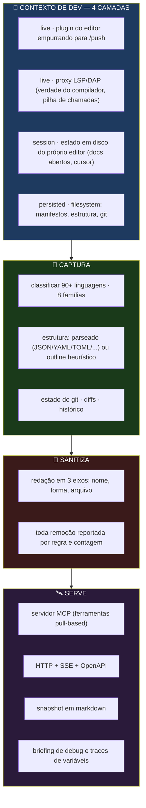
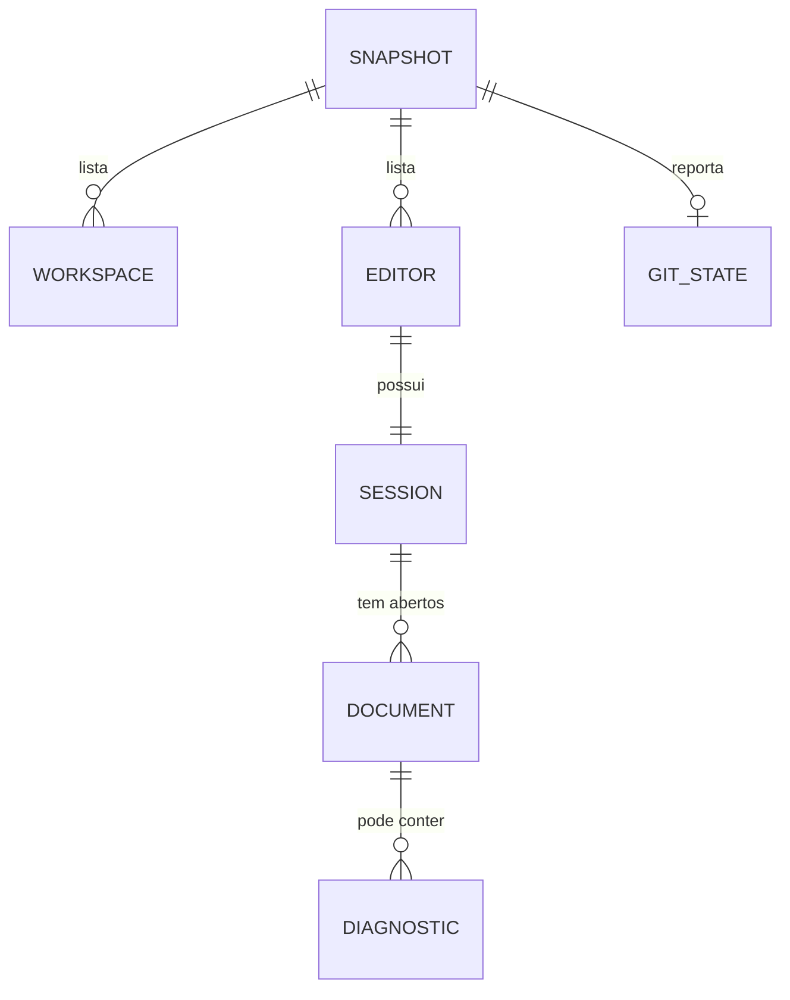
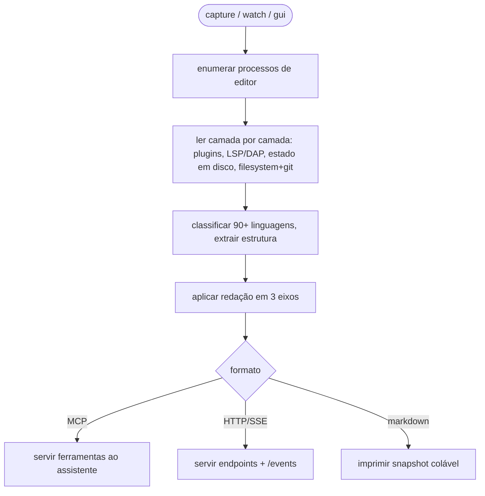
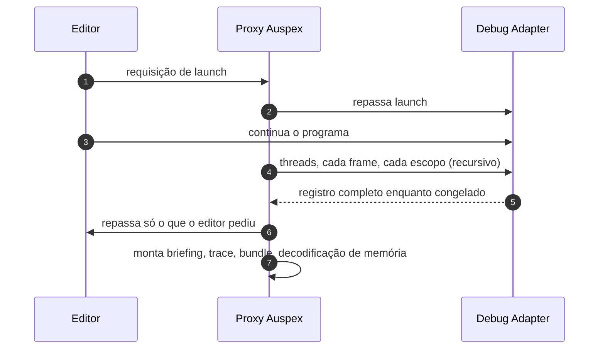

<div align="center">

**🌐 Choose Language / Selecione o Idioma / Elija el Idioma**

[](README.md)&nbsp;&nbsp;&nbsp;[](README_PT.md)&nbsp;&nbsp;&nbsp;[](README_ES.md)

</div>

---

<div align="center">

```
██╗   ██╗ █████╗ ██╗   ██╗██████╗ ███████╗██╗  ██╗
██║   ██║██╔══██╗██║   ██║██╔══██╗██╔════╝╚██╗██╔╝
██║   ██║███████║██║   ██║██████╔╝███████╗ ╚███╔╝
██║   ██║██╔══██║██║   ██║██╔═══╝ ╚════██║ ██╔██╗
╚██████╔╝██║  ██║╚██████╔╝██║     ███████║██╔╝ ██╗
 ╚═════╝ ╚═╝  ╚═╝ ╚═════╝ ╚═╝     ╚══════╝╚═╝  ╚═╝
   Um conector agnóstico de editor que leva o contexto de qualquer IDE a qualquer IA
```

---

[](https://www.typescriptlang.org/)
[](https://nodejs.org/)
[]()
[]()
[]()
[]()
[]()
[]()

<br/>

> **Auspex lê o que o desenvolvedor está fazendo de verdade — editores, projetos, arquivo ativo, cursor, diagnósticos, git —**
> de **qualquer editor**, em **qualquer linguagem**, e entrega para **qualquer IA** via MCP, HTTP puro ou markdown que você cola em qualquer lugar.
> Zero dependências de runtime, sem passo de compilação: o Node 22.6+ remove os tipos no carregamento.

<br/>


</div>

---

## 📑 Índice

<details>
<summary>▶️ <strong>Clique para expandir / recolher esta seção</strong></summary>

<table>
<tr>
<td valign="top" width="50%">

**🏗️ Sistema**
- [Visão Geral](#-visão-geral)
- [Arquitetura do Sistema](#-arquitetura-do-sistema)
- [Stack Tecnológica](#-stack-tecnológica)
- [Padrões de Projeto](#-padrões-de-projeto-aplicados)
- [Estrutura do Projeto](#-estrutura-do-projeto)

**📦 Módulos**
- [Comandos CLI](#-cli--a-superfície-de-comandos)
- [Captura de Contexto](#-captura-de-contexto--o-que-está-acontecendo)
- [Proxy LSP / DAP](#-proxy-lsp--dap--captura-profunda-de-debug)
- [Servidor MCP & HTTP](#-servidor-mcp--http)
- [Camada de Redação](#-camada-de-redação)

</td>
<td valign="top" width="50%">

**💼 Negócio**
- [Regras de Negócio](#-regras-de-negócio)
- [Requisitos Funcionais](#-requisitos-funcionais)
- [Requisitos Não Funcionais](#-requisitos-não-funcionais)

**📐 Design**
- [Modelo de Dados](#-modelo-de-dados)
- [Fluxos do Sistema](#-fluxos-do-sistema)

**🔐 Segurança & Operação**
- [Segurança](#-segurança)
- [Instalação & Execução](#-instalação--execução)
- [Testes Automatizados](#-testes-automatizados)
- [Métricas & Monitoramento](#-métricas--monitoramento)
- [Limitações Conhecidas](#-limitações-conhecidas)

</td>
</tr>
</table>

---

</details>

## 🌟 Visão Geral

<details>
<summary>▶️ <strong>Clique para expandir / recolher esta seção</strong></summary>

**Auspex** é um conector agnóstico de editor e ferramenta de debugging. Ele lê o que o desenvolvedor está fazendo de verdade — quais editores e projetos estão abertos, quais arquivos estão sendo editados e onde está o cursor, do que o compilador está reclamando, o que o git diz — de **qualquer IDE ou editor**, em **qualquer linguagem**, e entrega para **qualquer IA** via MCP, HTTP puro ou texto que você cola em qualquer lugar.

Ele funciona no terminal e no navegador, e não tem **nenhuma dependência de runtime**: o Node 22.6+ remove as anotações de tipo no carregamento, então não há passo de compilação. Clone e rode.

### 🎯 Objetivos do Sistema

| Objetivo | Descrição |
|----------|-----------|
| 🔍 **Captura universal de contexto** | Ler pastas abertas, abas, arquivo ativo, cursor, diagnósticos e estado do git de qualquer editor |
| 🧩 **Indiferença a linguagem** | Classificar arquivos em 90+ linguagens em 8 famílias, parseadas ou heurísticas |
| 🛰️ **Plugável para IA** | Expor o mesmo contexto via MCP, HTTP+SSE+OpenAPI ou markdown |
| 🔬 **Captura profunda de debug** | Gravar um programa pausado — threads, frames, variáveis, valores, memória — via proxy LSP/DAP |
| 🔒 **Seguro por padrão** | Redação ligada por padrão, segredos reportados, sem chaves, sem chamar API de IA |

---

</details>

## 🏗️ Arquitetura do Sistema

<details>
<summary>▶️ <strong>Clique para expandir / recolher esta seção</strong></summary>

### Diagrama de Fluxo



### Camadas da Arquitetura

| Camada | Papel |
|--------|-------|
| 🪟 **Adaptadores de plataforma** | Família VS Code, família JetBrains, Visual Studio, Sublime, Zed, Neovim, Vim, Emacs, Helix, Nova, Xcode, Eclipse, NetBeans, Notepad++, Kate, Geany + catch-all |
| 🧠 **Camada de linguagem** | Nome exato do arquivo → shebang → extensão; gramáticas parseadas vs. heurísticas de formato de declaração com rótulos honestos |
| 🔬 **Proxy de debug** | Intercepta a sessão DAP/LSP, emite requisições próprias enquanto o programa está congelado, nunca escreve no debuggee |
| 🛰️ **Camada de servidor** | Ferramentas MCP, endpoints HTTP (`/context`, `/documents`, `/diagnostics`, `/file`, `/git`, `/debug`, `/events`, `/push`) |
| 🔐 **Camada de redação** | Remoção por nome, por forma e por arquivo, tudo reportado |

---

</details>

## 🛠️ Stack Tecnológica

<details>
<summary>▶️ <strong>Clique para expandir / recolher esta seção</strong></summary>

<table>
<thead>
<tr>
<th>Camada</th>
<th>Tecnologia</th>
<th>Versão</th>
<th>Propósito</th>
</tr>
</thead>
<tbody>
<tr>
<td><strong>🧠 Linguagem</strong></td>
<td>TypeScript (ESM)</td>
<td>5.7 (só dev)</td>
<td>44 módulos; tipos removidos no carregamento, nunca compilado</td>
</tr>
<tr>
<td><strong>⚙️ Runtime</strong></td>
<td>Node.js</td>
<td>≥ 22.6</td>
<td>Remoção nativa de tipos — zero passo de build</td>
</tr>
<tr>
<td><strong>🛰️ Protocolo</strong></td>
<td>MCP · HTTP/SSE · OpenAPI · markdown</td>
<td>—</td>
<td>Três portas para qualquer assistente plugar</td>
</tr>
<tr>
<td><strong>🔬 Debugging</strong></td>
<td>Proxy LSP / DAP</td>
<td>—</td>
<td>Diagnósticos do compilador, árvores de símbolos, pilhas pausadas</td>
</tr>
<tr>
<td><strong>🔄 Fontes de dado</strong></td>
<td>Plugins de editor, estado em disco, filesystem, git</td>
<td>—</td>
<td>Quatro camadas de captura com proveniência e confiança por dado</td>
</tr>
<tr>
<td><strong>🧪 Testes</strong></td>
<td>node:test (nativo)</td>
<td>—</td>
<td>121 testes em 10 arquivos, sem dependência de framework</td>
</tr>
<tr>
<td><strong>🔧 Ferramentas</strong></td>
<td>tsc --noEmit, MIT</td>
<td>—</td>
<td>Só type-check; licença</td>
</tr>
</tbody>
</table>

---

</details>

## 📐 Padrões de Projeto Aplicados

<details>
<summary>▶️ <strong>Clique para expandir / recolher esta seção</strong></summary>

| Padrão | Onde | Justificativa |
|--------|------|---------------|
| 🔂 **Adapter / Strategy** | Um adaptador por editor, em camadas por capacidade | Cada editor expõe dados diferentes com frescor diferente |
| 🪜 **Fallback em camadas** | live → session → persisted | A camada de baixo (filesystem) é o piso que torna "qualquer editor" verdadeiro |
| 🏷️ **Rótulo honesto** | `parsed` vs `heuristic` em cada dado | Um modelo precisa saber o quanto confiar num resultado |
| 🔬 **Proxy / Decorator** | Proxy LSP/DAP entre editor e adaptador | Capturar fidelidade total sem tocar no debuggee |
| 🎯 **Ordenação por prioridade** | Orçamento de contexto determinístico (`--max-tokens`) | Descartar segue prioridade documentada, nunca arbitrária |
| 👁️ **Observer** | `/push`, watch via WS, modo watch | Notificações ao vivo de mudança para editores que conseguem empurrar |
| 🚦 **Guarda-corpos** | Relatório de redação, aviso do `--no-redact` | Segurança é opt-out e visivelmente assim |

---

</details>

## 📁 Estrutura do Projeto

<details>
<summary>▶️ <strong>Clique para expandir / recolher esta seção</strong></summary>

```
auspex/
│
├── 📄 package.json                  # ESM, bin auspex → src/cli/main.ts, sem deps
├── 📄 tsconfig.json                 # só type-check
│
├── 📂 src/
│   ├── 📂 core/                     # modelo de contexto normalizado, redação, orçamentos
│   ├── 📂 adapters/                 # adaptadores por editor + filesystem + git
│   ├── 📂 languages/                # classificação de 90+ linguagens, estrutura em 2 camadas
│   ├── 📂 platform/                 # descoberta de processos do SO (editores, workspaces)
│   ├── 📂 debug/                    # proxy DAP, captura profunda, briefing, tracing
│   ├── 📂 server/                   # endpoints MCP + HTTP/SSE + OpenAPI + push
│   ├── 📂 ai/                       # modelagem de ferramentas/formato para o assistente
│   └── 📂 cli/                      # main.ts — capture/watch/gui/mcp/serve/debug/connect
│
├── 📂 extensions/vscode/            # plugin zero-config (tracker de debug adapter)
├── 📂 docs/                         # ARCHITECTURE, ADAPTERS, DEBUG, AI-DEBUGGING, ROADMAP
├── 📂 tests/                        # 10 arquivos *.test.ts + fixtures
│
├── 📄 README.md                     # 🇺🇸 Inglês (principal)
├── 📄 README_PT.md                  # 🇧🇷 Português
└── 📄 README_ES.md                  # 🇪🇸 Espanhol
```

---

</details>

## 📦 Módulos do Sistema

<details>
<summary>▶️ <strong>Clique para expandir / recolher esta seção</strong></summary>

### 🖥️ CLI — a superfície de comandos

| Comando | O que faz |
|---------|-----------|
| `capture` | O que está acontecendo agora, no terminal |
| `watch` | O mesmo, ao vivo |
| `gui` | O mesmo, no navegador |
| `mcp` | O mesmo, como servidor MCP para o Claude |
| `serve` | O mesmo, como HTTP + SSE + OpenAPI para GPT/Gemini |
| `doctor` | Por que minha captura está fina? |
| `connect mcp / openai / gemini` | Imprime a config para colar em cada assistente |

### 📡 Captura de Contexto — o que está acontecendo

Lê editores, workspaces, arquivo ativo, cursor, buffers não salvos, diagnósticos e estado do git. Cada dado é etiquetado com **de qual camada veio e o quanto confiar nele**.

### 🔬 Proxy LSP / DAP — captura profunda de debug

Coloque o Auspex entre o editor e o debug adapter e ele captura o processo pausado inteiro: todo thread, frame, escopo, variável expandida recursivamente, memória bruta, módulos carregados e o que mudou desde a última parada. Comandos: `proxy --dap --deep -- <adapter>`, `debug`, `debug trace`, `debug threads`, `debug bundle`. A extensão do VS Code registra um tracker de debug adapter para **todo** adapter — F5 captura a sessão com zero configuração.

### 🛰️ Servidor MCP & HTTP

Ferramentas MCP: `get_context`, `get_open_files`, `get_diagnostics`, `get_file`, `search`, `get_git_status`, `list_editors` mais um conjunto completo de ferramentas de debug. HTTP: `/context`, `/documents`, `/diagnostics`, `/file`, `/git`, `/debug` + `/events` (SSE) e `/push` (plugins). Markdown `capture --format markdown` é o fallback universal.

### 🔐 Camada de Redação

Nome da chave, forma do valor e o arquivo onde mora — três eixos ao mesmo tempo. Arquivos que só guardam credenciais (`.env`, `id_rsa`, `*.pem`, `.npmrc`, `credentials`) são recusados pelo nome; os *nomes* de variáveis do `.env` são mantidos, os valores nunca. Toda remoção é reportada por regra e contagem.

---

</details>

## 📋 Regras de Negócio

<details>
<summary>▶️ <strong>Clique para expandir / recolher esta seção</strong></summary>

| # | Regra | Aplicação |
|---|-------|-----------|
| BR-01 | Redação ligada por padrão; desligar exige `--no-redact` e um aviso | Flag de CLI + aviso impresso |
| BR-02 | Arquivos que só contêm credenciais são recusados pelo nome, nunca lidos e limpos | Lista de redação por arquivo |
| BR-03 | Todo segredo removido é reportado por regra e contagem | Relatório de redação em todo snapshot |
| BR-04 | Todo dado diz qual camada o produziu e o quanto confiar nele | Metadados de proveniência |
| BR-05 | O proxy de debug nunca escreve no debuggee | Sem `setVariable`, sem `evaluate` injetado |
| BR-06 | Auspex nunca chama API de IA e não guarda chaves | Arquitetura só-server: ele lê, você pergunta |
| BR-07 | Orçamentos de contexto descartam por ordem de prioridade determinística documentada | `--max-tokens` + lista `warnings` |

---

</details>

## ✨ Requisitos Funcionais

<details>
<summary>▶️ <strong>Clique para expandir / recolher esta seção</strong></summary>

| ID | Requisito | Prioridade | Status |
|----|-----------|------------|--------|
| **RF-01** | Capturar editores, workspaces, arquivo ativo, cursor e diagnósticos | 🔴 Alta | ✅ Implementado |
| **RF-02** | Suportar adaptadores dedicados para 30+ editores + catch-all | 🔴 Alta | ✅ Implementado |
| **RF-03** | Classificar arquivos em 90+ linguagens em 8 famílias | 🔴 Alta | ✅ Implementado |
| **RF-04** | Estrutura genuinamente parseada para JSON/YAML/TOML/INI/CSV/etc. | 🟡 Média | ✅ Implementado |
| **RF-05** | Rotular outlines heurísticos com honestidade | 🟡 Média | ✅ Implementado |
| **RF-06** | Ler status, diffs e histórico do git | 🟡 Média | ✅ Implementado |
| **RF-07** | Servir contexto via MCP, HTTP+SSE+OpenAPI e markdown | 🔴 Alta | ✅ Implementado |
| **RF-08** | Capturar sessão de debug LSP/DAP completa sem tocar no debuggee | 🔴 Alta | ✅ Implementado |
| **RF-09** | Produzir briefings de debug e traces de variáveis no formato da IA | 🟡 Média | ✅ Implementado |
| **RF-10** | Redigir segredos em três eixos, reportando toda remoção | 🔴 Alta | ✅ Implementado |
| **RF-11** | Ajustar capturas a um orçamento de tokens por prioridade determinística | 🟡 Média | ✅ Implementado |
| **RF-12** | Rodar `watch` ao vivo e `gui` no navegador | 🟢 Baixa | ✅ Implementado |

---

</details>

## ⚙️ Requisitos Não Funcionais

<details>
<summary>▶️ <strong>Clique para expandir / recolher esta seção</strong></summary>

| ID | Categoria | Requisito | Meta |
|----|-----------|-----------|------|
| **RNF-01** | 🧱 Dependências | Dependências de runtime | Zero — só stdlib e Node |
| **RNF-02** | ⚡ Build | Passo de compilação | Nenhum — stripping de tipos do Node 22.6+ |
| **RNF-03** | 📱 Compatibilidade | Piso do Node | ≥ 22.6 |
| **RNF-04** | ⚡ Performance | Captura completa de uma máquina em uso | Dimensionada por `--max-tokens`, normalmente < 1 MB |
| **RNF-05** | 🔐 Privacidade | Tratamento de segredos | Redigir por padrão, reportar toda remoção |
| **RNF-06** | 🔐 Privacidade | Chamadas a APIs de IA | Nunca — sem chaves, sem tráfego de IA de saída |
| **RNF-07** | 🧱 Mantenibilidade | Cobertura de testes | 121 testes em 10 arquivos, incluindo debug end-to-end |

---

</details>

## 🗄️ Modelo de Dados

<details>
<summary>▶️ <strong>Clique para expandir / recolher esta seção</strong></summary>

> [!NOTE]
> Auspex não mantém banco de dados. Seu "modelo de dados" é o snapshot de contexto normalizado e o bundle portátil de sessão de debug.

### Snapshot de Contexto



| Entidade | Conteúdo |
|----------|----------|
| `workspace` | raiz, contagem/tamanho de arquivos, divisão por linguagem, manifestos, status do git |
| `editor` / `session` | pid, adaptadores, documentos abertos, cursor, seleção, buffers não salvos |
| `document` | caminho, família de linguagem, diagnósticos com severidade |
| `git_state` | branch, arquivos alterados, diffs, histórico de commits (conforme orçamento) |

### Bundle de Sessão de Debug

`debug bundle f.gz` grava um registro portátil e ajustado a orçamento de toda a sessão pausada — threads, frames, toda variável com seus valores, memória bruta, além do próprio código-fonte — para anexar a um bug report.

---

</details>

## 🔄 Fluxos do Sistema

<details>
<summary>▶️ <strong>Clique para expandir / recolher esta seção</strong></summary>

### Fluxo de Captura



### Fluxo de Sessão de Debug



---

</details>

## 🔐 Segurança

<details>
<summary>▶️ <strong>Clique para expandir / recolher esta seção</strong></summary>

### Controles Implementados

| Control | Implementação | Efeito |
|---------|---------------|--------|
| 🔐 **Redação por padrão** | Conjunto de regras em 3 eixos (nome, forma, arquivo) | Segredos removidos a menos que seja explicitamente desligada |
| 🚫 **Recusa por nome** | `.env`, `id_rsa`, `*.pem`, `.npmrc`, `credentials` nunca são lidos | Sem limpeza em arquivos que só existem para guardar credenciais |
| 📋 **Relatório de redação** | Toda remoção por regra e contagem | Nada é apagado em silêncio |
| 🔬 **Debug somente leitura** | Sem `setVariable`, sem `evaluate` injetado | Auspex não consegue mudar o que mede |
| 🚫 **Sem egresso de IA** | Nunca chama API de IA, não guarda chaves | Seu contexto só vai onde você enviar |
| 📦 **HTML autônomo** | (padrão do csradar, nenhum aqui) | — |

### Limitações de Segurança Conhecidas

| Limitação | Risco | Caminho de mitigação |
|-----------|-------|----------------------|
| 🪶 **Segredos inócuos passam** | Um segredo com cara de texto comum sob um nome comum passa | Nenhum redator conserta isso; documentado com honestidade |
| 🧪 **Desconfiança de terceiros** | Seu contexto de trabalho é entregue a quem você conectar | MCP é pull-based: o assistente só recebe o que pede |
| 📄 **Sem rede nos testes** | Runner de testes nativo do Node | Testes herméticos e sem dependência de runtime |

---

</details>

## 🚀 Instalação & Execução

<details>
<summary>▶️ <strong>Clique para expandir / recolher esta seção</strong></summary>

### Pré-requisitos

```bash
node --version   # Node 22.6 ou mais novo (remoção de tipos)
```

### Instalar & Rodar

```bash
git clone <este repositório> && cd auspex
npm test                 # 121 testes, sem instalar nada
node src/cli/main.ts editors   # o que eu consigo ver?
```

`npm install` só é necessário para `npm run typecheck` (TypeScript como dependência de dev); nada é necessário para rodar.

### Comandos

```bash
node src/cli/main.ts capture            # snapshot agora
node src/cli/main.ts watch              # ao vivo
node src/cli/main.ts gui                # no navegador
node src/cli/main.ts mcp                # servidor MCP para o Claude
node src/cli/main.ts serve              # HTTP + SSE + OpenAPI
node src/cli/main.ts proxy --dap --deep -- <adapter>  # debug profundo
node src/cli/main.ts debug ...          # briefing / trace / threads / bundle
node src/cli/main.ts connect mcp        # cole esta config no Claude
```

### Extensão VS Code

Copie `extensions/vscode` para o diretório de extensões, rode `serve`, e o cursor, seleções e buffers não salvos começam a chegar. Ela não precisa de nenhuma configuração.

---

</details>

## 🧪 Testes Automatizados

<details>
<summary>▶️ <strong>Clique para expandir / recolher esta seção</strong></summary>

### Arquitetura de Testes

```bash
npm test                # node --test "tests/*.test.ts"
npm run typecheck       # tsc --noEmit
```

121 testes em 10 arquivos cobrindo: adaptadores, linguagens, modelo core, endpoints de servidor e **debug end-to-end** — captura via proxy, interpretação de valores, consultas, análise e formato do briefing de IA. Os fixtures de teste vivem em `tests/fixtures`.

### Destaques de Cobertura

| Suíte | Escopo |
|-------|--------|
| `adapters.test.ts` | Cada camada de adaptador de editor exercitada |
| `languages.test.ts` | Classificação de 90+ linguagens, parseada vs heurística |
| `core.test.ts` | Redação, modelo, orçamentos |
| `server.test.ts` | Endpoints MCP + HTTP |
| `debug-*.test.ts` (5 arquivos) | Captura via proxy, valores, análise, consultas, briefing de IA |

---

</details>

## 📊 Métricas & Monitoramento

<details>
<summary>▶️ <strong>Clique para expandir / recolher esta seção</strong></summary>

| Métrica | Valor |
|---------|-------|
| Módulos TypeScript | 44 |
| Arquivos de teste / testes | 10 / 121 passando |
| Linguagens reconhecidas | 90+, em 8 famílias |
| Adaptadores de editor | 30+ dedicados + catch-all |
| Dependências de runtime | 0 |
| Piso do Node | 22.6 |

### Comandos de Diagnóstico

```bash
node src/cli/main.ts doctor       # por que minha captura está fina?
node src/cli/main.ts serve        # depois curl localhost:<porta>/context
```

---

</details>

## ⚠️ Limitações Conhecidas

<details>
<summary>▶️ <strong>Clique para expandir / recolher esta seção</strong></summary>

> [!IMPORTANT]
> Auspex é um leitor e uma camada de serviço, deliberadamente não um diagnosticador — saber que `user` é `None` na linha que o desreferencia não diz se a culpa é do dereference, da busca ou do chamador.

| Categoria | Problema | Status |
|-----------|----------|--------|
| 🪶 **Segredos inócuos** | Um segredo com formato de texto comum passa | ⚠️ Documentado; inerente à redação |
| 🧩 **Linguagens desconhecidas** | Apenas outlines heurísticos para linguagens nunca vistas | ⚠️ Mitigado pelo proxy LSP para símbolos exatos |
| ⚡ **Piso do Node** | Exige Node ≥ 22.6 para remoção de tipos | ⚠️ Trade-off documentado por zero build |
| 🧩 **Snapshots colados e velhos** | Um paste em markdown está velho antes da primeira resposta | ⚠️ MCP é pull-based e preferido por isso |
| 🔬 **POV vs demos de servidor** | n/a aqui | — |

</details>

---

<div align="center">

---

### 🔭 Auspex

*Lê qualquer editor. Serve qualquer IA.*

[](https://www.typescriptlang.org/)
[](https://nodejs.org/)
[]()

<br/>

```
"Uma ferramenta para ler qualquer IDE, para qualquer IA — sem instalar nada."
```

</div>